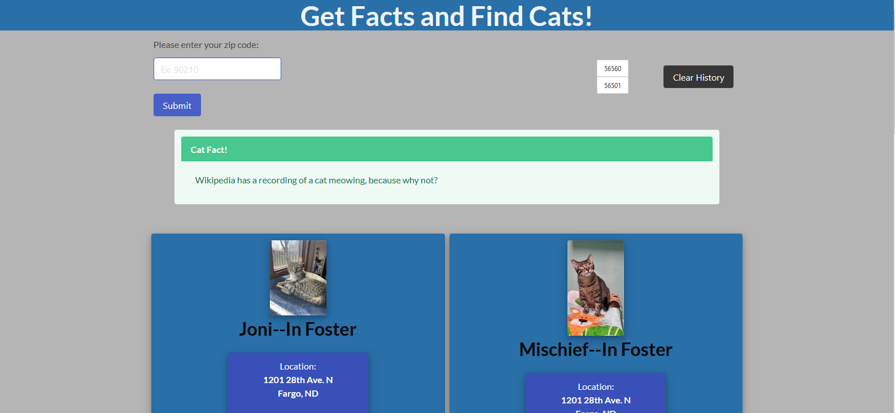

# Get Facts and Find Cats

[Get Facts and Find Cats Website](https://mcamy2001.github.io/Get-Facts-and-Find-Cats)

## Description
Many shelters across the country have plenty of cats that are waiting to be adopted. If you've been thinking about welcoming a new furry friend into your home, one of those cats could be yours -- but where to look? And if you've never owned a cat before, how much do you really know about them? Sounds like you need to Get Facts and Find Cats.

GFAFC is a webpage where a user can search for rescue cats near them using the API for RescueGroups.org's nationwide database of adoptable pets. By typing in their ZIP code, they will be presented with a short list of cats available for adoption within 25 miles of that area, as well as the address and phone number of the shelter where they're staying. Each time the user makes a search for nearby cats, they are also presented with one of various facts about cats. This serves to equip them with fun trivia as well as make them better informed on what a cat likes and needs from the person taking care of it.

The idea and motivation for Get Facts and Find Cats was to have a simple, easy-to-use, and unique information hub for potential cat owners. By equipping them with the ability to search for nearby available pets while simultaneously feeding them snippets of useful and fun cat knowledge, we the developers feel we are doing our part to ensure every cat out there finds a loving, knowledgable, and responsible human to give them a home.

## APIs
RescueGroups.org: https://rescuegroups.org/services/adoptable-pet-data-api/  
Cat Facts by Alex Wohlbruck: https://alexwohlbruck.github.io/cat-facts/docs/

